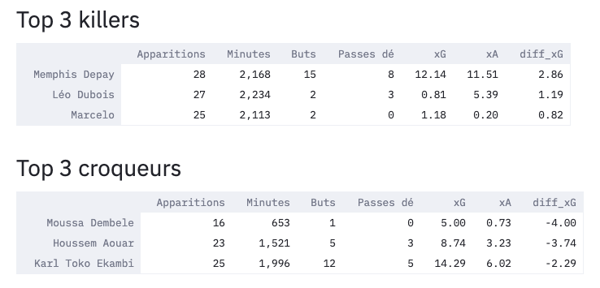

# xG_Tracker
## Which team or player under or overperformed ?

https://xg-tracker.herokuapp.com/

xG_Tracker est une web-app codée en Python permettant la visualisation de la performance
des joueurs à partir de leur xGoals. 

## Description du projet

Les **xGoals** sont une statistique qui indique, pour chaque, quelle est la probabilité
que ce tir se transforme en but. Ainsi, chaque occasion est quantifiée entre 0 
(très peu probable que le tir se transforme en but) et 1 (très probable que
le tir se transforme en but), en fonction de nombreux paramètres tels que la 
position du tireur, la pression des adversaires, la position du gardien, 
la distance au but, etc. 

## Fonctionnalités

L'outil présente 5 fonctionnalités : 
1. Voir pour une équipe et une saison quels sont les joueurs qui ont surperformé
par rapport à leur xGoals, et à l'inverse ceux qui ont sous-performé
2. Même chose, pour les xAssists
3. Le top 3 meilleurs performeurs/pires performeurs dans l'équipe
4. La différence entre le xGoals et les buts effectivement inscrits par situation
de jeu, pour identifier les points forts/faibles d'une équipe
5. La qualité moyenne des tirs proposés et subis par situation de jeu, pour 
évaluer la domination d'une équipe

### Feature n°1

### Feature n°3

### Feature n°4

## Améliorations futures
TODO : 
* Ajouter des statistiques par championnat pour comparer directement les équipes
* Rendre l'update des données automatiques
